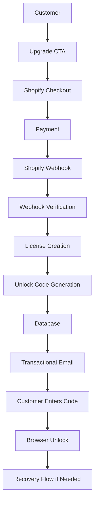
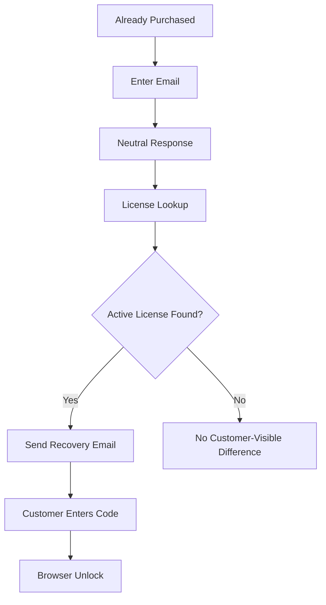
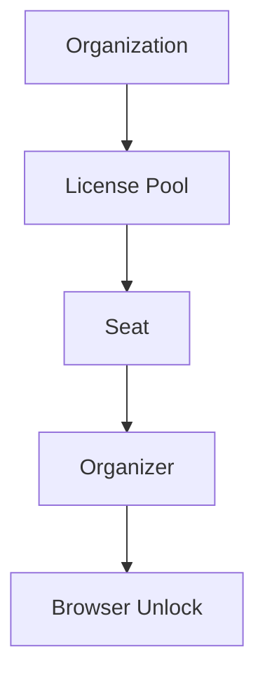

# Commerce Architecture v1

## Executive Summary

JoinDraftPick Complete uses a deliberately simple commerce architecture:

- Shopify owns checkout and payment.
- JoinDraftPick owns licensing.
- The database owns truth.
- The browser stores convenience unlock state only.
- Email owns recovery.
- Postmark is the recommended transactional email provider.

This architecture keeps Version 1 aligned with the product promise: fast setup, one organizer, one active device, and no accounts for players. It also protects future organization licensing without adding organization complexity to Sprint 009B.

## Product Philosophy

### One Organizer

Licenses belong to organizers, not players. Players should never need accounts, payment, recovery, or licensing.

### One Device

The organizer can run a room from one device. Browser unlock state exists only to remove repeated setup friction.

### One Minute

The complete path should remain short: buy, receive code, unlock browser, create teams.

## Core Architecture



Responsibilities:

- **Shopify:** checkout, payment collection, payment status, order identity.
- **JoinDraftPick:** license creation, unlock code generation, validation, recovery.
- **Database:** source of truth for licenses, status, events, recovery, and purchase linkage.
- **Browser:** convenience state after successful validation.
- **Email:** delivery and recovery channel.
- **Postmark:** recommended transactional email provider for purchase confirmation, unlock code delivery, and recovery email.

## License Model

Recommended `licenses` model:

| Field | Purpose |
|---|---|
| `id` | Internal database UUID primary key. |
| `public_license_id` | Permanent human-readable support ID, such as `JDP-L-00001247`. Not secret. |
| `license_owner_email` | Primary owner of the license entitlement. |
| `billing_email` nullable | Email from Shopify/payment receipt; may differ from license owner. |
| `unlock_code_hash` | Hashed unlock code. Plaintext unlock codes must never be stored. |
| `license_origin` | Source of license creation. |
| `purchase_date` nullable | When payment happened. |
| `created_at` | When the license record was created. |
| `updated_at` | When the license record was last updated. |
| `activated_at` nullable | First successful browser unlock. |
| `status` | License lifecycle state. |
| `last_used_at` nullable | Most recent successful use or validation. |
| `recovery_enabled` | Whether self-service recovery is allowed. |
| `organization_id` nullable | Future organization owner. |
| `license_pool_id` nullable future | Future organization pool. |
| `seat_id` nullable future | Future assigned seat. |
| `assigned_organizer_email` nullable | Future organizer assigned to a seat/license. |
| `version` | License contract/schema version. |
| `notes` | Internal support/admin notes. |
| `shopify_order_id` nullable | Shopify order reference. |
| `shopify_customer_id` nullable | Shopify customer reference. |
| `product_key` | Product entitlement, such as `complete_v1`. |

Timestamp distinctions:

- `purchase_date` = when payment happened.
- `created_at` = when the license record was created.
- `activated_at` = first successful browser unlock.

Email distinctions:

- `license_owner_email` = entitlement owner.
- `billing_email` = payment receipt email.
- `organization_owner_email` = future organization admin contact.
- `assigned_organizer_email` = future person assigned to use a seat.
- `recovery_email` = email entered during recovery.

## License Statuses

| Status | Allows Unlock? | Purpose |
|---|---:|---|
| `pending` | No | Payment/webhook observed but license is not fully deliverable yet. |
| `active` | Yes | Normal paid or valid license. |
| `refunded` | No | Payment was refunded. New unlocks and recovery are blocked. |
| `revoked` | No | Access removed for fraud, abuse, chargeback, or support decision. |
| `transferred` future | No for old holder | Future organizer reassignment state. |
| `archived` | No | Historical record retained with no access. |

Only `active` licenses should allow unlock, browser reactivation, and recovery.

## License Origin Values

| Value | Meaning |
|---|---|
| `shopify` | Normal purchase through Shopify checkout. |
| `manual` | Created manually by support/admin. |
| `organization` | Created from a future organization license pool. |
| `complimentary` | Free access intentionally granted. |
| `test` | Internal QA/test license. |

`license_origin` helps support, reporting, complimentary access, future organization licensing, testing, and Shopify reconciliation without relying on support notes.

## Browser Recognition Strategy

The browser may store convenience unlock state:

```json
{
  "unlocked": true,
  "licenseId": "uuid",
  "publicLicenseId": "JDP-L-00001247",
  "productKey": "complete_v1",
  "unlockedAt": "timestamp",
  "lastVerifiedAt": "timestamp"
}
```

The browser must not store:

- plaintext unlock code
- payment data
- Shopify secrets
- email verification secrets
- device fingerprint

Browser unlock state is convenience only. The database remains the source of truth.

No licensing decision should rely on:

- IP address
- device fingerprinting
- browser fingerprinting

## Recovery Flow



Recovery principles:

- Email owns recovery.
- Responses must be neutral to avoid email enumeration.
- Recovery requests must be rate-limited.
- If an active license exists, send recovery instructions.
- If no active license exists, show the same customer-facing response.

Recommended neutral copy:

> If an active purchase exists for that email, we sent recovery instructions.

## Shopify Webhook Architecture

Shopify webhook responsibilities:

1. Receive Shopify payment/order webhook.
2. Verify raw-body HMAC using Shopify webhook secret.
3. Check webhook idempotency using Shopify webhook ID.
4. Check order idempotency using Shopify order ID.
5. Create or update license.
6. Generate unlock code.
7. Store unlock code hash, never plaintext.
8. Log license and webhook events.
9. Send transactional email.
10. Return success quickly.

Required behaviors:

- Webhook processing must be idempotent.
- Duplicate delivery must not create duplicate licenses.
- Raw request body must be used for HMAC verification.
- Failed email delivery must not delete or invalidate the license.
- Reconciliation must be possible for paid orders with missing emails or failed webhook processing.

## Email Delivery Architecture

Recommended provider: **Postmark**.

Email types:

- purchase confirmation
- unlock code delivery
- recovery email
- future organization invitation

Email delivery rules:

- Log email send attempts.
- Log email failures.
- Do not log plaintext unlock codes.
- Recovery can resend or rotate codes.
- Email failure should create an operational event, not block license existence.

## Failure Modes

| Scenario | Expected Behavior | Recovery Path |
|---|---|---|
| Payment succeeds, webhook delayed | Success page says code is on the way. | Shopify retry or reconciliation. |
| Webhook delivered twice | Idempotency skips duplicate. | No customer action. |
| Webhook fails | Shopify retries; failure logged. | Reconciliation path. |
| Email fails | License remains created; email failure logged. | Recovery resend. |
| Customer closes browser after payment | Email still delivers unlock code. | Recovery if needed. |
| Customer clears browser history | Browser unlock disappears. | Email recovery. |
| Customer uses new device | New browser is not automatically unlocked. | Email recovery. |
| Customer buys twice | Preserve purchase history; create separate license or future seat. | Support can inspect by public license ID. |
| Wrong recovery email | Neutral response. | Customer retries correct email. |
| Refund occurs | License becomes `refunded`. | Unlock/recovery disabled. |
| License revoked | License becomes `revoked`. | Support/admin decision required. |
| Future organization buys multiple seats | Seats are future architecture only. | License pool/seat model later. |

## Security Rules

Required rules:

- No plaintext unlock codes in database or logs.
- Unlock codes use secure random generation with sufficient entropy.
- Store hash plus server-side pepper.
- Shopify webhooks require raw-body HMAC verification.
- Webhooks must be idempotent.
- No IP-based licensing.
- No device fingerprinting.
- No browser fingerprinting.
- Recovery responses must be neutral.
- Recovery and unlock attempts must be rate-limited.
- Secrets stay server-side.
- Browser storage contains convenience state only.
- Database remains source of truth.

`public_license_id` is not secret and must never grant access by itself.

### Commerce RLS Principle

All new commerce-related database tables must default to least-privilege RLS policies. Existing gameplay tables may be reviewed and hardened in a future dedicated security sprint, but `licenses`, `license_events`, `webhook_events`, recovery flows, and future organization licensing tables should be restrictive from day one.

Commerce tables must not inherit the current permissive gameplay-table RLS pattern:

- `licenses` must not be publicly selectable, insertable, updatable, or deletable.
- `webhook_events` and `license_events` must be server-only.
- License validation must happen through server-side actions or API routes.
- Supabase service role access must remain server-only.
- Browser/client code must never access commerce tables directly.
- Existing RLS advisor warnings on gameplay tables are acknowledged but out of scope for Sprint 009B.
- A future security hardening sprint should review gameplay table RLS separately.

## Future Organization and Seat Hierarchy

Do not implement organization seats in Sprint 009B.

Reserve the future hierarchy:



Clarifications:

- Version 1 remains individual-license only.
- Sprint 009B has no organization dashboard.
- Sprint 009B has no seat assignment UI.
- Organizations license organizers, not players.
- Players never need accounts or licenses.

## Sprint 009B Implementation Milestones

### Milestone 1: Purchase → License → Unlock Code → Email → Browser Unlock

Objective:

- End-to-end activation after Shopify payment.

Acceptance criteria:

- Paid Shopify event creates one license.
- Unlock code is generated and emailed.
- Code unlocks Complete in browser.
- Duplicate webhook does not create duplicate license.

### Milestone 2: Recovery

Objective:

- A customer can restore access after browser deletion or new device.

Acceptance criteria:

- Already Purchased flow accepts email.
- Response is neutral.
- Active license receives recovery email.
- Browser can unlock again.

### Milestone 3: Monitoring and Reconciliation

Objective:

- Make commerce failures visible and recoverable.

Acceptance criteria:

- Webhook events are logged.
- License events are logged.
- Email failures are logged.
- Manual reconciliation path exists for paid orders without delivered unlock email.

### Milestone 4: Organization-Ready Fields

Objective:

- Preserve future organization licensing without adding V1 complexity.

Acceptance criteria:

- Nullable future organization fields do not affect individual purchase flow.
- No organization dashboard.
- No seat UI.
- Individual licenses remain simple.

## Final Approval Note

This architecture preserves:

- One Organizer
- One Device
- One Minute

It is intentionally simple for Version 1 while preserving future organization licensing, license reassignment, complimentary access, testing, and reconciliation.

**APPROVED FOR SPRINT 009B IMPLEMENTATION**
