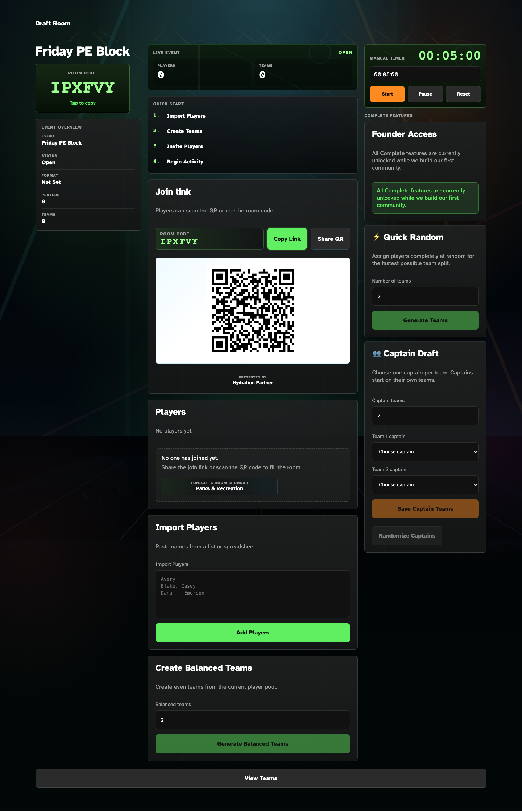
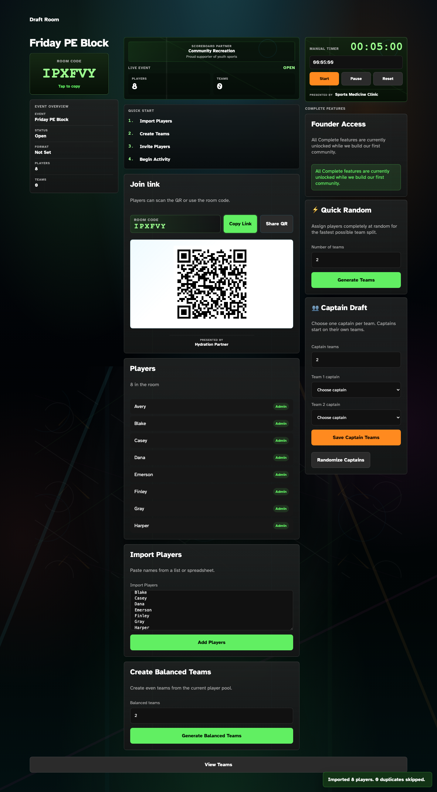
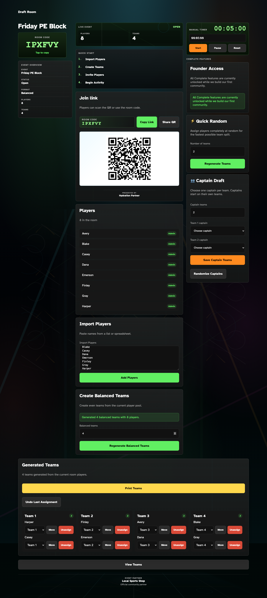
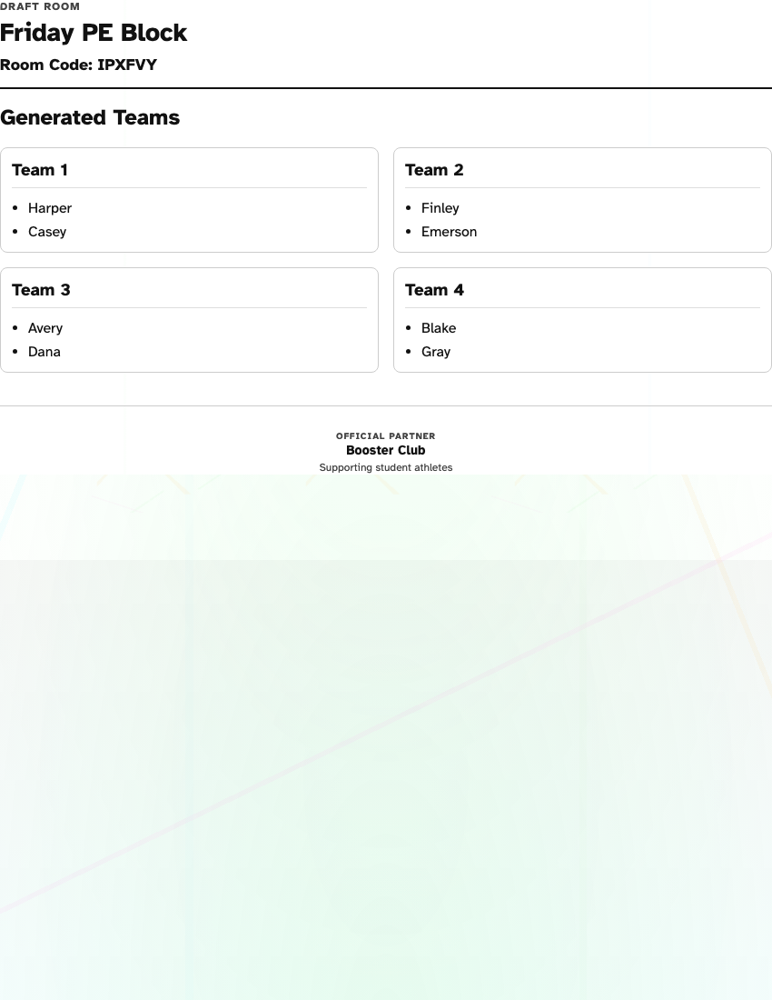

# Arena Visual QA — Sponsorship & Experience Review

Session date: 2026-07-18  
Branch: `codex/court-grid-layout-experiment`  
Room tested: Friday PE Block (local demo)

Screenshots in this folder capture five event phases at desktop (1440px), tablet (1024px), and mobile (390px) where noted.

---

## Annotated Screenshots

### 1. Waiting for Players

| Annotation | Observation |
| --- | --- |
| A — QR join card | Primary action clear; room code and copy link dominate |
| B — Below-QR mark | Single subtle "Presented by Hydration Partner" — appropriate |
| C — Waiting ribbon | "Tonight's Room Sponsor" only in empty player state — venue-appropriate |
| D — No scoreboard/timer/footer sponsors | Phase gating working; density low (2 placements) |

Mobile: `01-waiting-for-players-390.png` — waiting ribbon and QR mark stack cleanly; no crowding.

### 2. Players Joining

| Annotation | Observation |
| --- | --- |
| A — Scoreboard ribbon | Visible once players arrive; reads as live-event signage |
| B — Live Event stats | Players/teams remain dominant over sponsor ribbon |
| C — Timer mark | Small "Presented by Sports Medicine Clinic" — secondary to countdown |
| D — Waiting ribbon | Correctly absent once players exist |

### 3. Ready to Generate Teams

Same sponsor set as phase 2 (scoreboard + below-QR + timer). Primary CTA remains **Generate Balanced Teams**.

### 4. Teams Generated

| Annotation | Observation |
| --- | --- |
| A — Scoreboard/timer sponsors | Correctly hidden once teams exist |
| B — Below-QR mark | Still visible — acceptable persistent join signage |
| C — Footer partner | "Event Partner — Local Sports Shop" at page perimeter after team reveal |
| D — Generated Teams | Output section visually dominates footer sponsor |

### 5. Print View

| Annotation | Observation |
| --- | --- |
| A — Roster header | Clean tournament handout typography |
| B — Print footer | "Official Partner — Booster Club" — excellent venue program placement |

---

## Sponsor Placement Audit

| Placement | Visibility | Context | Workflow | Phase Rule (implemented) |
| --- | --- | --- | --- | --- |
| **Scoreboard ribbon** (`leaderboard`) | Noticed naturally when live | Yes — attached to Live Event panel | Does not block actions | **Active event only** (players > 0, no teams) |
| **Below-QR mark** (`below_qr`) | Subtle, always readable | Yes — join-area signage | Safe to ignore | **Always visible** |
| **Waiting ribbon** (`waiting_screen`) | Moderate in empty state | Yes — gather-phase banner | Only in empty player list | **Waiting only** |
| **Timer mark** (`timer_panel`) | Subtle | Yes — clock sponsorship | Timer remains dominant | **Active event only** (players > 0, no teams) |
| **Page footer** (`footer`) | Moderate after teams | Yes — perimeter signage | Below primary workflow | **Team reveal only** (teams > 0) |
| **Print footer** (`printable_roster_footer`) | Clear on printout | Excellent — program footer | Zero digital workflow impact | **Print only** |
| **Room page leaderboard/footer** | Removed | N/A | Player join path stays clean | **Never** (removed from `/room/[id]`) |

---

## Density Assessment

### Before QA (all placements always on)

**Verdict:** Commercially crowded — up to 5 sponsors visible simultaneously during waiting/active phases. Repetitive "Presented by" language. Felt advertising-first.

### After QA (phase-gated inventory)

| Phase | Visible sponsors | Verdict |
| --- | --- | --- |
| Waiting | 2 (below-QR + waiting) | Premium, believable |
| Gathering / ready | 3 (scoreboard + below-QR + timer) | Professionally sponsored |
| Teams generated | 2 (below-QR + footer) | Calm; teams dominate |
| Print | 1 (roster footer) | Excellent |

**Overall density verdict:** Premium and believable after phase gating. Quality over quantity.

---

## Event Phase Recommendations

| Placement | Recommendation | Reasoning |
| --- | --- | --- |
| Scoreboard ribbon | Active event only | Tied to live participation; meaningless before players arrive |
| Below-QR mark | Always visible | Persistent join signage; small; does not rotate awkwardly |
| Waiting ribbon | Waiting only | Natural gather-moment inventory |
| Timer mark | Active event only | Timer irrelevant before/at team reveal |
| Admin footer | Team reveal only | Perimeter signage after organizer completes core task |
| Print footer | Print only | Tournament program metaphor |
| Room page sponsors | Never | Player-facing join view should stay clean |

---

## Experience Audit

| Criterion | Score | Notes |
| --- | --- | --- |
| Eye movement | Good | Center column draws eye: Quick Start → Join → Players → Teams |
| Visual hierarchy | Improved | Sponsors subordinate to workflow cards |
| Calmness | Good | Phase gating reduced noise significantly |
| Atmosphere | Good | Dark venue palette; court-line background still present but softer |
| Confidence | Good | Live Event stats and room code feel authoritative |
| Professionalism | Good | Sponsor copy reads as venue partnership, not banner ads |
| Venue authenticity | Moderate–Good | Ribbons/marks feel architectural; card count still slightly SaaS |

### Remaining SaaS signals

- Three-column admin layout still reads as control dashboard at 1440px (acceptable for organizer mode)
- Complete Features stack on right rail is dense
- Multiple card borders in center column (unchanged this session — out of sponsorship scope)

---

## Changes Made

1. **`venueSponsorVisibility.ts`** — central phase rules for sponsor inventory
2. **`VenuePresentation`** — accepts arena context; renders nothing when phase rules fail
3. **Component wiring** — Live Event, timer, player list, generated teams, admin footer pass player/team counts
4. **Room page** — removed leaderboard and footer sponsors from player-facing view
5. **Screenshots** — captured five phases for regression reference

---

## Remaining Concerns

- **below_qr always on** is correct for join context but should stay a mark, never grow into a card
- **Team-reveal ribbon** above Generated Teams is a future opportunity (not added — would increase density)
- **Court-floor background** may still skew sci-fi at certain angles; separate atmosphere pass
- **Screenshot automation** requires local Supabase; script at `scripts/arena-visual-qa.mjs`

---

## Overall Arena Score

**7.5 / 10**

**Explanation:** The Arena now feels closer to a premium athletic venue preparing people to play. Sponsorship reads as architectural signage that rotates with the event rather than stacking on every screen. Workflow priority is preserved. Points withheld for remaining dashboard density in the three-column organizer layout and decorative floor treatment — atmosphere refinements beyond sponsorship scope.

---

## Validation

- `pnpm lint` — pass
- `pnpm build` — pass
- Desktop (1440), tablet (1024), mobile (390) — reviewed via captured screenshots
